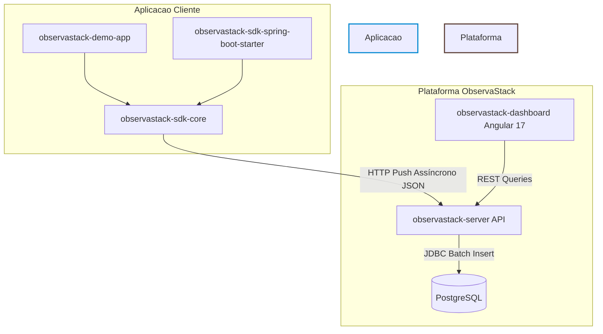

# ObservaStack

### Plataforma de observabilidade simplificada para aplicações Spring Boot — métricas, traces distribuídos e alertas em um único lugar, sem configurar Prometheus e Grafana do zero.


---

## 1. O Problema

Em arquiteturas modernas, a observabilidade é um requisito obrigatório para produção. Contudo, a stack convencional de mercado — composta por Prometheus, Grafana, Jaeger e OpenTelemetry Collector — impõe uma complexidade operacional severa. Configurar, conectar e manter essa infraestrutura exige horas de engenharia, gerando custos de manutenção contínua e *vendor lock-in* para equipes que precisam apenas monitorar seus ecossistemas de forma direta.

O **ObservaStack** resolve essa fricção eliminando os intermediários. Ao adicionar uma única dependência Maven e uma configuração minimalista no arquivo de propriedades, a sua aplicação Spring Boot ganha distributed tracing automático (padrão W3C), coleta nativa de telemetria da JVM (via JFR) e uma interface visual rica com gráficos de árvore (*flame graphs*) — tudo centralizado em um banco de dados PostgreSQL que você já possui.

---

## 2. Quick Start

Para começar a coletar e centralizar a telemetria do seu ecossistema, basta configurar o SDK em dois passos simples:

### Passo 1: Adicione a dependência no seu `pom.xml`
```xml
<dependency>
    <groupId>io.observastack</groupId>
    <artifactId>observastack-sdk-spring-boot-starter</artifactId>
    <version>0.1.0-SNAPSHOT</version>
</dependency>
```

### Passo 2: Configure o apontamento no seu `application.yml`
```yaml
observastack:
  server-url: "http://localhost:8080"
  sampling:
    rate: 1.0
  buffer:
    max-size: 1000
```

## 3. Arquitetura do Sistema


### Decisões Arquiteturais Fundamentais
* **Segregação Estrita de Frameworks (ADR-4):** O módulo `observastack-sdk-core` é escrito em Java puro (agnóstico de framework), utilizando o `java.net.http.HttpClient` nativo para garantir que a biblioteca possa ser acoplada a qualquer sistema Java sem poluir o classpath com o Spring.
* **CQRS em Nível Lógico:** O módulo `observastack-server` separa os fluxos de escrita (`ReceiveTraceUseCase`, `ReceiveMetricsUseCase`) dos fluxos de leitura (`QueryTraceUseCase`), permitindo otimizações de banco de dados independentes para cada perfil de tráfego.
* **Isolamento de Recursos e Filas:** O SDK mantém instâncias e threads dedicadas do `MetricDispatcher` e do `SpanDispatcher` operando em buffers `ArrayBlockingQueue` separados para que uma explosão de métricas não atrase o envio de traces de requisições.

## 4. Diferenciais Técnicos
* **JVM Flight Recorder (JFR) Event Streaming API:** Coleta de métricas internas da JVM (CPU, Heap, GC e Contagem de Threads) de forma puramente passiva e assíncrona, eliminando completamente o overhead tradicional induzido por reflexão ou polling JMX ativo.
* **W3C TraceContext Propagation:** Implementação nativa dos cabeçalhos `traceparent` padrão da indústria. Garante a correlação de traces distribuídos de ponta a ponta entre microsserviços sem acoplamento com contextos Spring.
* **SDK com Fallback Resiliente:** Em caso de indisponibilidade ou lentidão da API do servidor, o SDK retém os dados em uma `ArrayBlockingQueue` circular limitada e aciona retentativas com backoff exponencial via Resilience4j. Se o buffer lotar, o span mais antigo é descartado sob log WARN, blindando a aplicação monitorada contra estouro de memória (OutofMemoryError).
* **Armazenamento Otimizado em PostgreSQL:** Sem dependências de Cassandra, Elasticsearch ou Jaeger. Os traces e spans utilizam tabelas normalizadas com suporte a colunas JSONB indexadas via índices GIN, reduzindo drasticamente o custo de infraestrutura.
* **Amostragem Baseada na Cabeça (Head-based Sampling):** Algoritmo determinístico baseado no hash do traceId aplicado na origem (SDK), reduzindo o tráfego de rede e o consumo de disco em ambientes de alta concorrência.

## 5. Stack Tecnológica & Justificativas
| Tecnologia | Justificativa de Engenharia |
|---|---|
| **Java 21 + Spring Boot 3.2** | Uso de recursos de linguagem modernos (como Records imutáveis e Pattern Matching) aliados a uma linha de runtime estável de mercado para o ecossistema corporativo. |
| **NamedParameterJdbcTemplate** | Adotado na camada de infraestrutura em substituição ao JPA (`saveAll()`) para o fluxo de escrita massiva. Contorna o Merge Check do Hibernate em entidades com IDs gerados externamente, garantindo Zero SELECTs parasitas e forçando um JDBC Batch Update puro. |
| **Hibernate 6 (JSONB mapping)** | Utilização do `@JdbcTypeCode(SqlTypes.JSON)` nativo para mapear os mapas de atributos dinâmicos dos spans no PostgreSQL sem a necessidade de bibliotecas extras de terceiros. |
| **Angular 17 + Angular Material** | Arquitetura SPA limpa baseada em componentes visuais reativos pré-construídos, acelerando a entrega de grids, paginações e seletores consistentes. |
| **D3-flame-graph** | Instanciação direta da biblioteca D3 no ciclo `ngAfterViewInit` do Angular para renderizar a árvore cronológica de spans de forma performática e nativa no DOM. |

## 6. Desafios Técnicos Resolvidos

**Desafio 1: Inserções em Lote Gerando Queries SELECT Ocultas**
* **Causa Raiz:** Como os identificadores (traceId e spanId) são gerados de forma distribuída pelo SDK (IDs externos) e não de forma incremental pelo banco de dados, o método `saveAll()` do Spring Data JPA interpretava as entidades como novos registros a serem atualizados ou inseridos via `merge()`. O Hibernate disparava um comando SELECT por registro para validar a existência prévia antes do INSERT, transformando a operação em um gargalo de 2N queries.
* **Solução:** O repositório de persistência foi reescrito descendo o nível de abstração para o `NamedParameterJdbcTemplate`. Foi implementado um comando SQL nativo utilizando a cláusula `INSERT ... ON CONFLICT (id) DO NOTHING` encapsulado em um lote de execução JDBC (`batchUpdate`). O comportamento eliminou por completo os SELECTs ocultos, mantendo a escrita em complexidade estável de rede.

**Desafio 2: Condições de Corrida nos Testes de Streaming da JVM**
* **Causa Raiz:** A API RecordingStream do JFR roda em uma thread daemon em background. Durante o início das suítes de testes automatizados integrados, a pipeline fria da JVM demandava alguns milissegundos para disparar os primeiros eventos periódicos (como o uso de CPU). Isso gerava asserções falhas de forma intermitente (flaky tests) se os testes tentassem ler o banco imediatamente após a chamada do método.
* **Solução:** Incorporamos a biblioteca Awaitility nos testes de integração. Em vez de sleeps imperativos fixos, os testes passaram a utilizar varreduras assíncronas com intervalos de amostragem inteligentes (`pollInterval(200ms)` com timeout de 10s), aguardando o aquecimento do stream e a confirmação de escrita do dado real na base antes de liberar a validação técnica.

**Desafio 3: Tipagem Inexistente de Componentes Visuais de Terceiros**
* **Causa Raiz:** A biblioteca gráfica d3-flame-graph foi empacotada em formato ES6 (`es.js`) sem fornecer os arquivos de definição de tipo do TypeScript (`.d.ts`), e o repositório comunitário `@types` não possuía mapeamento atualizado para a versão utilizada. O compilador do Angular barrava o build de produção por falha de resolução de símbolos.
* **Solução:** Criamos uma folha de tipagem customizada local em `src/d3-flame-graph.d.ts` mapeando e exportando o módulo como um default export e vinculando as assinaturas de inicialização baseadas no ElementRef do Angular, permitindo que a transpilação do `ng build` executasse com sucesso total.

## 7. Estratégia de Testes
O projeto foi construído sob uma mentalidade rigorosa de testes automatizados e controle de regressões, contando com as seguintes coberturas:
* **Testes Baseados em Propriedades (Property-Based via jqwik):** Utilizados no SDK para estressar os algoritmos de geração de IDs hexadecimais aleatórios e a integridade de decodificação do W3C traceparent (1.000 cenários randomizados testando o round-trip de ponta a ponta sem falhas de corrupção).
* **Testes de Concorrência Extrema:** Simulação de 2.000 inserções concorrentes geradas por dezenas de threads simultâneas na fila `ArrayBlockingQueue` do SDK, comprovando o isolamento do mecanismo de Backpressure contra erros de modificação concorrente.
* **Testes de Ingestão com Banco Real (Testcontainers):** Execução das migrations Flyway e validação de escrita e leitura de métricas e traces contra uma instância real do PostgreSQL inicializada em container Docker.
* **Proteção Programática contra N+1:** Uso do interceptador de conexões `datasource-proxy` configurado exclusivamente para ambiente de teste. Os testes do repositório capturam o total de comandos SQL gerados e falham explicitamente se a inserção de um lote de spans disparar mais do que 1 query de Trace e 1 query em lote de Spans.
* **Nota de Robustez Ambiental:** Toda a suíte de testes de integração é envelopada pela anotação customizada `@EnabledIfDockerAvailable`. Se o ambiente de build (local ou esteira CI) não possuir o Docker daemon ativo, os 17 testes de integração são graciosamente ignorados (skipped) em vez de quebrar a esteira de compilação.

## 8. Rodando Localmente

**Pré-requisitos**
* Java 21 (JDK) instalado
* Node.js 18+ instalado
* Docker e Docker Compose instalados e em execução

### Passo 1: Clonar e Compilar o Backend
```bash
git clone https://github.com/seu-usuario/observastack.git
cd observastack
mvn clean install -DskipITs
```

### Passo 2: Subir a Infraestrutura (Banco de Dados)
```bash
docker compose up -d
```

### Passo 3: Inicializar a Aplicação Servidor e a Demo App
```bash
mvn spring-boot:run -pl observastack-server
# Em outro terminal:
mvn spring-boot:run -pl observastack-demo-app
```

### Passo 4: Inicializar o Dashboard Angular
```bash
cd observastack-dashboard
npm install
npm start
```

## 9. Roadmap de Evolução
* **Autenticação e Isolamento Multi-Tenancy:** Inclusão de Spring Security (JWT) na API e suporte a chaves de acesso (`X-Api-Key`) no SDK para segregar dados de diferentes microsserviços e clientes no PostgreSQL.
* **Motor de Alertas Reativo (Alerting Engine):** Implementação de um avaliador de limiares de métricas periódicas (ex: uso de CPU > 90% por 3 minutos) com envio de notificações automático para Slack, e-mail ou webhooks.
* **Camada de Ingestão Bufferizada Reativa:** Substituição do processamento síncrono nos controladores HTTP do servidor por arquitetura orientada a eventos utilizando fluxos reativos do Project Reactor para aumentar o throughput de ingestão sob carga extrema.
* **Política de Expansão e Expurgo de Dados (Data Purge):** Implementação de rotinas agendadas (`@Scheduled`) para automatizar o descarte de dados históricos de telemetria frios com mais de 15 dias de existência, preservando o espaço em disco.

---
Construído como projeto de portfólio para demonstrar conhecimento de observabilidade de ponta — do instrumento ao dashboard — sem dependência de ferramentas externas de terceiros.
